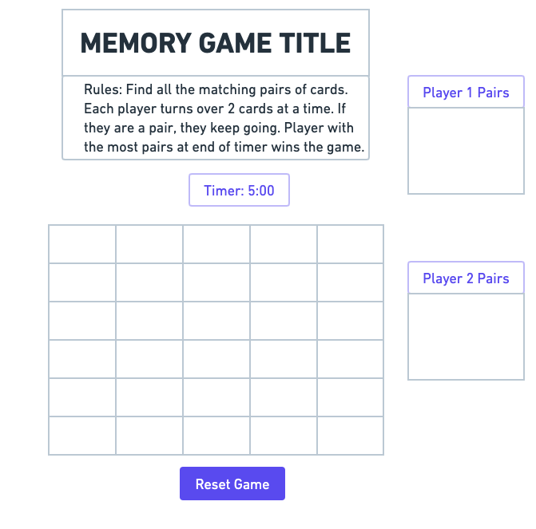

# Concentration/Memory Game
​

​

## Constants: 
- cardTypes (pictures/icon pairs in array)
- timerLimit
  

## State variables: 
- gameBoard 
	- grid/layout of the cards (2D array)
	- whether cards are face up or face down
	- matched or unmatched
- cardState
	- visibility: face up or face down
	- status: matched or unmatched
- score
	- stores number of pairs
	- can be single variable for single player 
	- can be an array for multiple players
- gameState
	- initialState
		- when game begins or is reset
	- endState
		- when all cards are visible
- playerTurn
	- switches with cardState and gameState
  
## Cached Elements: 
- cardPairs
	- matched or visible cards (pairs)
- messageEl
	- outputs after every player turn or game state
- playAgainButton

  
## Event Listeners:
- On player selection (on click) flip card
	- document.getElemenById('card').addEventListener('click', handleCardFlip);
- playAgainButton
	- playAgainButton.addEventListener('click', init)
  

## Functions:
- Initialize all state 
	- function init()
- render
	- update all DOM state
- randomizeBoard
	- function algorithm that re-orders the grid position of cards
- checkForPairs
	- checks if current player selections are a pair or not
	- if pair is true = add to score, otherwise hide cards (face down)
- Timer
	- Have a count down from set timer limit
	- begin count down on first click
	- stop count down when all board elements are visible
- getWinner
	- tallies up the score when game ends
