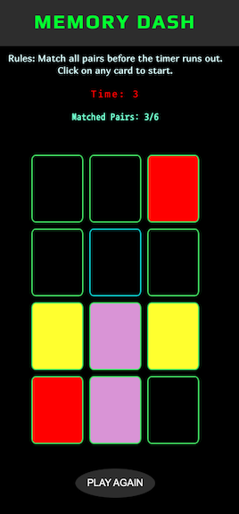
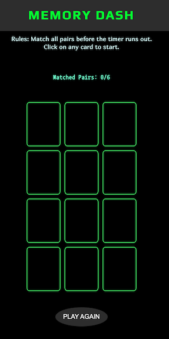
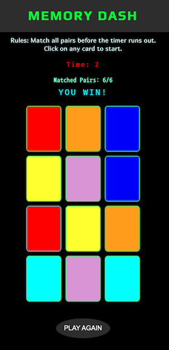
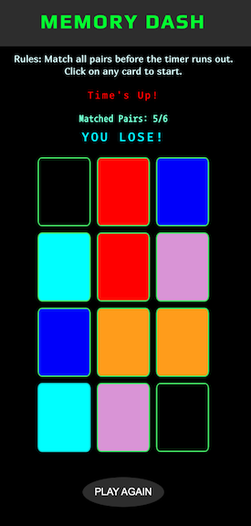

# Memory Dash
Memory Dash is a fast-paced memory matching game. Test your memory skills and race against the clock in this exciting challenge!

## Game Objective
The objective of Memory Dash is to match all the pairs of cards within the given time limit. Players need to flip cards and remember their positions to make successful matches. The game ends when all pairs are matched or when the timer runs out.

## Getting Started
### Live Link:
Click on the following link to open the live version of the game:
[Memory-Dash](https://avilla13.github.io/Concentration-Memory/)

### How to Play
1. Launch the game by opening this [link](https://avilla13.github.io/Concentration-Memory/) in browser (or live link above).
2. The game board will display a grid of cards (face-down). 
   
3. Click on two cards to reveal their faces. The timer will begin when first card is flipped.
4. If the cards match, they will remain face-up and you will earn point.
5. If the cards do not match, they will be flipped back face-down.
6. Continue flipping cards and making matches until all pairs are found.
   
7. If you match all pairs before the time runs out, you win the game.
   
8. If the time runs out before all pairs are matched, you lose the game.
   

## Technologies

## Future Features
- Add difficulty levels that take card types, allotted time and number of cards as the driving parameters
- Keep track of clicks to provide user feedback message based on the number of clicks, matched pairs and remaining time (if any)